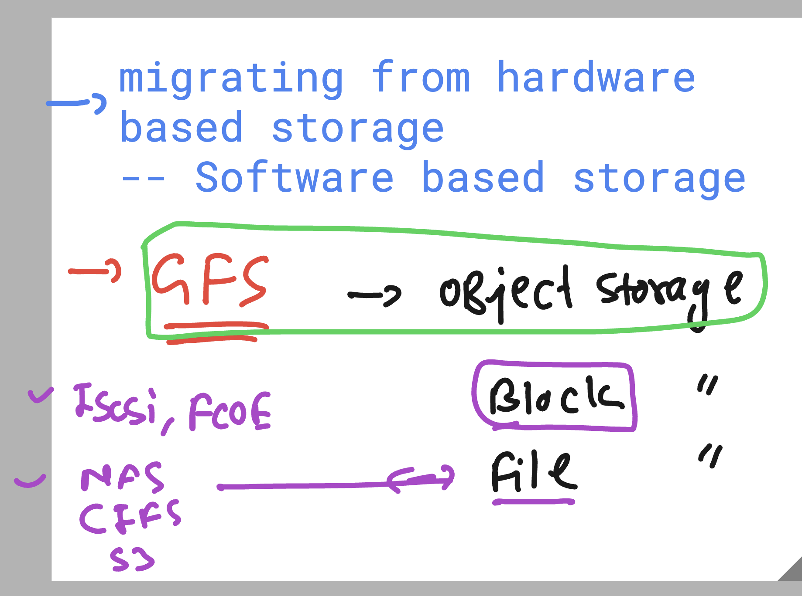
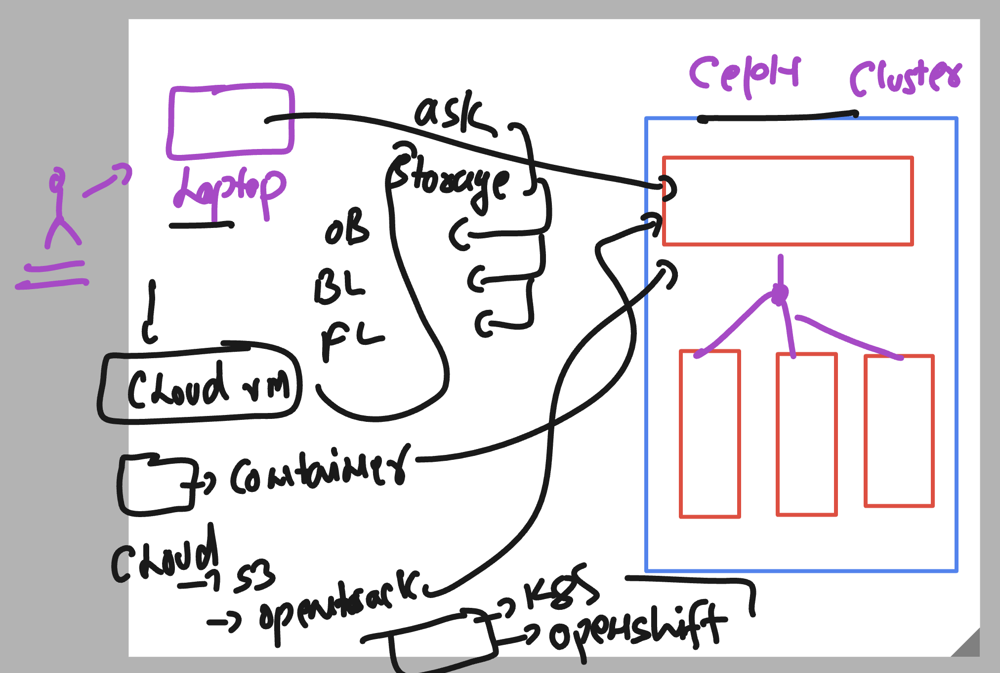
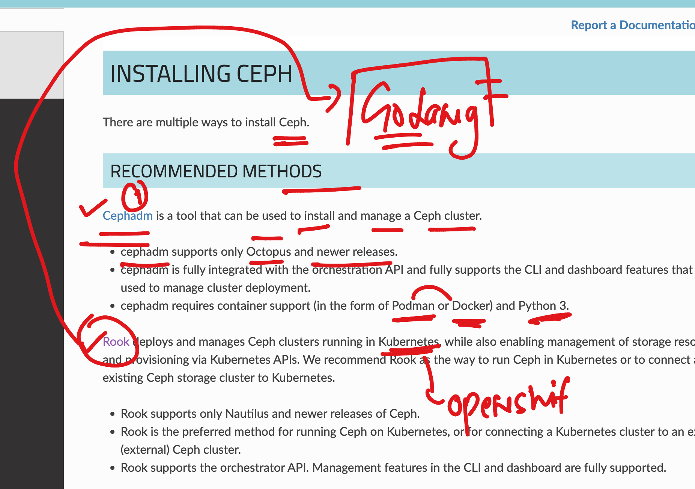
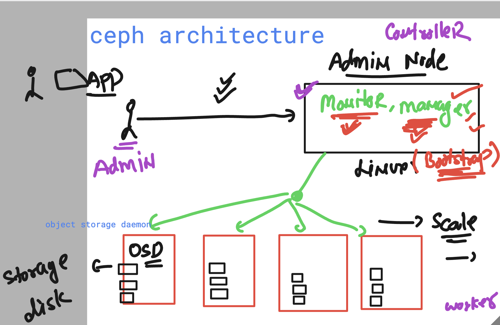
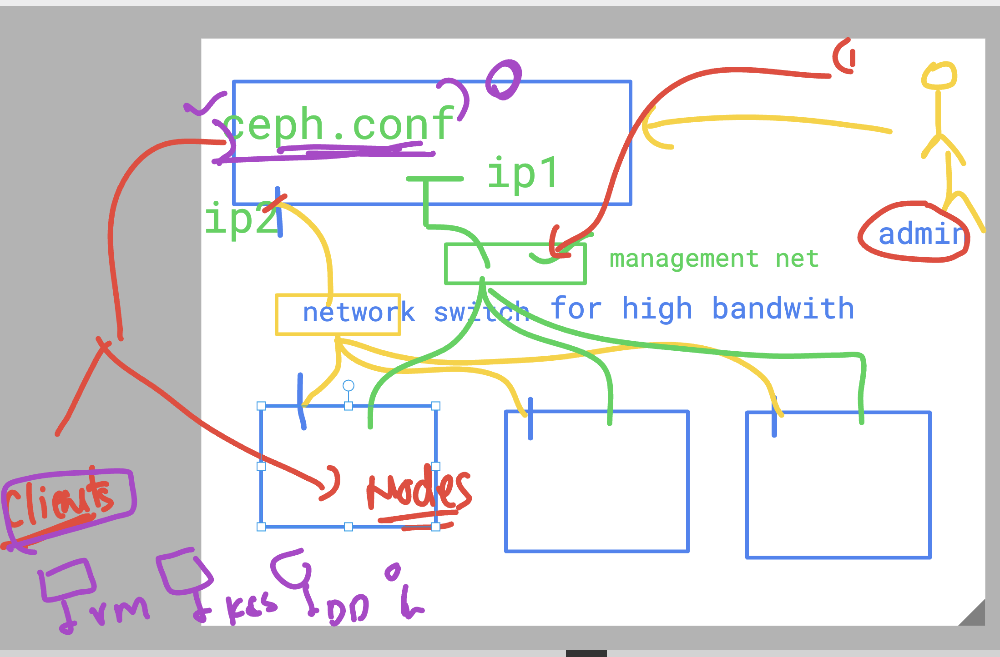

### software define storage 

### basic info 




### storage access options 



### chef cluster setup with container support 



### simple ceph architecture is like 



### setup 3 node ceph cluster 

### login to node1 -- to configure this as Monitor / manager 

```
 C:\Users\hp>
PS C:\Users\hp>
PS C:\Users\hp> ssh  -i .\Downloads\orangekey.cer   ec2-user@18.188.68.153
Last login: Mon Mar 10 09:05:11 2025 from 106.219.69.80
[ec2-user@ip-172-31-4-54 ~]$
[ec2-user@ip-172-31-4-54 ~]$
[ec2-user@ip-172-31-4-54 ~]$
[ec2-user@ip-172-31-4-54 ~]$

```

### changing hostname of machines 

```
ec2-user@ip-172-31-4-54 ~]$ sudo -i
[root@ip-172-31-4-54 ~]# 
[root@ip-172-31-4-54 ~]# whoami
root
[root@ip-172-31-4-54 ~]# hostnamectl set-hostname  ashu-mon 
[root@ip-172-31-4-54 ~]# 
[root@ip-172-31-4-54 ~]# exit
logout
[ec2-user@ip-172-31-4-54 ~]$ sudo -i
[root@ashu-mon ~]# hostname
ashu-mon
[root@ashu-mon ~]# 

```

### history 

```
  9  yum  install net-tools -y 
   10  vim /etc/hosts 
   11  dnf install vim -y
   12  dnf install vim net-tools  -y
   13  ifconfig 
   14  vim /etc/hosts
   15  cat  /etc/hosts
   16  history 
[root@ashu-mon ~]# cat  /etc/hosts
127.0.0.1   localhost localhost.localdomain localhost4 localhost4.localdomain4
::1         localhost localhost.localdomain localhost6 localhost6.localdomain6


172.31.4.54   ashu-mon 
[root@ashu-mon ~]# 
[root@ashu-mon ~]# vim /etc/hosts
[root@ashu-mon ~]# 
[root@ashu-mon ~]# cat  /etc/hosts
127.0.0.1   localhost localhost.localdomain localhost4 localhost4.localdomain4
::1         localhost localhost.localdomain localhost6 localhost6.localdomain6


172.31.4.54   ashu-mon 
172.31.10.59   ashu-node1
172.31.9.143   ashu-node2

```

### changing selinux security to permissive mode 

```
[root@ashu-mon sshd_config.d]# cat  /etc/selinux/config 

# This file controls the state of SELinux on the system.
# SELINUX= can take one of these three values:
#     enforcing - SELinux security policy is enforced.
#     permissive - SELinux prints warnings instead of enforcing.
#     disabled - No SELinux policy is loaded.
# See also:
# https://access.redhat.com/documentation/en-us/red_hat_enterprise_linux/9/html/using_selinux/changing-selinux-states-and-modes_using-selinux#changing-selinux-modes-at-boot-time_changing-selinux-states-and-modes
#
# NOTE: Up to RHEL 8 release included, SELINUX=disabled would also
# fully disable SELinux during boot. If you need a system with SELinux
# fully disabled instead of SELinux running with no policy loaded, you
# need to pass selinux=0 to the kernel command line. You can use grubby
# to persistently set the bootloader to boot with selinux=0:
#
#    grubby --update-kernel ALL --args selinux=0
#
# To revert back to SELinux enabled:
#
#    grubby --update-kernel ALL --remove-args selinux
#
SELINUX=permissive

```

### above file changes need a restart so we are doing it 

```
[root@ashu-mon sshd_config.d]# getenforce 
Enforcing
[root@ashu-mon sshd_config.d]# setenforce  0
[root@ashu-mon sshd_config.d]# 
[root@ashu-mon sshd_config.d]# getenforce 
Permissive

```

### verify connection of ssh with root user from ashu-mon to osd nodes

```
[root@ashu-mon ~]# cat  /etc/hosts
127.0.0.1   localhost localhost.localdomain localhost4 localhost4.localdomain4
::1         localhost localhost.localdomain localhost6 localhost6.localdomain6


172.31.4.54   ashu-mon 
172.31.10.59   ashu-node1
172.31.9.143   ashu-node2
[root@ashu-mon ~]# whoami 
root
[root@ashu-mon ~]# ssh  ashu-node1  
The authenticity of host 'ashu-node1 (172.31.10.59)' can't be established.
ED25519 key fingerprint is SHA256:El0WcNO3MtY0/nv4OdeVstAkDuc9HO6QXgscgu+AlqI.
This key is not known by any other names
Are you sure you want to continue connecting (yes/no/[fingerprint])? yes
Warning: Permanently added 'ashu-node1' (ED25519) to the list of known hosts.
root@ashu-node1's password: 
[root@ashu-node1 ~]# exit
logout
Connection to ashu-node1 closed.
[root@ashu-mon ~]# ssh  ashu-node2
The authenticity of host 'ashu-node2 (172.31.9.143)' can't be established.
ED25519 key fingerprint is SHA256:yql0hOr67Tgm2fADHo6mHskcaaarJX9V7Z7Hq9hi/Yw.
This key is not known by any other names
Are you sure you want to continue connecting (yes/no/[fingerprint])? yes
Warning: Permanently added 'ashu-node2' (ED25519) to the list of known hosts.
root@ashu-node2's password: 
[root@ashu-node2 ~]# 

```

### generating ssh-keypair for password less auth on ashu-mon node

```
ssh-keygen 
Generating public/private rsa key pair.
Enter file in which to save the key (/root/.ssh/id_rsa): 
Enter passphrase (empty for no passphrase): 
Enter same passphrase again: 
Your identification has been saved in /root/.ssh/id_rsa
Your public key has been saved in /root/.ssh/id_rsa.pub
The key fingerprint is:
SHA256:ti1RdLlbC+zcw0aoIAlRWgVNbu6fqk7gA4pcgNpounE root@ashu-mon
The key's randomart image is:
+---[RSA 3072]----+
|    .o+=o . ..   |
|.   .o ... ..    |
|..  .. .o .. o   |
|.o.   oo..  = o  |
|o.o..  .S. + B . |
|=..o . o +. + *  |
|=.E o . + .  . . |
| +   o   o .     |
|.    .o...o      |
+----[SHA256]-----+

```

### transfering public key to other OSD nodes

```
[root@ashu-mon ~]# ssh-copy-id    ashu-node1 
/bin/ssh-copy-id: INFO: Source of key(s) to be installed: "/root/.ssh/id_rsa.pub"
/bin/ssh-copy-id: INFO: attempting to log in with the new key(s), to filter out any that are already installed
/bin/ssh-copy-id: INFO: 1 key(s) remain to be installed -- if you are prompted now it is to install the new keys
root@ashu-node1's password: 

Number of key(s) added: 1

Now try logging into the machine, with:   "ssh 'ashu-node1'"
and check to make sure that only the key(s) you wanted were added.

[root@ashu-mon ~]# ssh-copy-id    ashu-node2
/bin/ssh-copy-id: INFO: Source of key(s) to be installed: "/root/.ssh/id_rsa.pub"
/bin/ssh-copy-id: INFO: attempting to log in with the new key(s), to filter out any that are already installed
/bin/ssh-copy-id: INFO: 1 key(s) remain to be installed -- if you are prompted now it is to install the new keys
root@ashu-node2's password: 

Number of key(s) added: 1

Now try logging into the machine, with:   "ssh 'ashu-node2'"
and check to make sure that only the key(s) you wanted were added.

[root@ashu-mon ~]# 

```

## Installing EPEL and REEF for ceph installation 

```
dnf -y install centos-release-ceph-reef epel-release 

Last metadata expiration check: 2:16:01 ago on Mon 10 Mar 2025 09:12:19 AM UTC.
Dependencies resolved.


===> verify this 

[root@ashu-mon ~]# cd /etc/yum.repos.d/
[root@ashu-mon yum.repos.d]# ls
centos-addons.repo     centos.repo                 epel-cisco-openh264.repo  epel-next-testing.repo  epel-testing.repo
CentOS-Ceph-Reef.repo  CentOS-Storage-common.repo  epel-next.repo            epel.repo
[root@ashu-mon yum.repos.d]# 

===> Installing Ceph 

 dnf install ceph -y

```

### ceph.conf 

```
[global]
# these are optional 
cluster network =  172.31.0.0/20
public network =  172.31.0.0/20 

# ip address of monitor host 
mon host = 172.31.4.54
# hostname of monitor initator node 
mon initial members = ashu-mon1  
osd pool default crush rule = -1
# file system id 
fsid = 73126190-66a0-425d-bc7b-971b13e67210 

```

### final ceph.conf file on monitor node 

```
[global]
# these are optional 
cluster network =  172.31.0.0/20
public network =  172.31.0.0/20 

# ip address of monitor host 
mon host = 172.31.4.54
# hostname of monitor initator node 
mon initial members = ashu-mon  
osd pool default crush rule = -1
# file system id 
fsid = 73126190-66a0-425d-bc7b-971b13e67210 

# about all monitoring nodes we gonna write info here 
# generally there is no auto scaling recomdended in monitoring nodes 
#
# mon.(Node name)
[mon.ashu-mon]
# specify Hostname of Monitor Daemon
host = ashu-mon
# specify IP address of Monitor Daemon
mon addr = 172.31.4.54
# allow to delete pools
mon allow pool delete = true

```

### Installing ceph package in all the data node (OSD)

```
dnf -y install centos-release-ceph-reef epel-release 
dnf install ceph -y 

```

### Now copy ceph.conf from monitor node to all data nodes (OSD)

```
[root@ashu-mon ceph]# scp  /etc/ceph/ceph.conf   ashu-node1:/etc/ceph/
ceph.conf                                                                                                  100%  646   369.6KB/s   00:00    
[root@ashu-mon ceph]# scp  /etc/ceph/ceph.conf   ashu-node2:/etc/ceph/
ceph.conf                                                                                                  100%  646   994.9KB/s   00:00    
[root@ashu-mon ceph]# 


```

### concepts views 



### Generating Cluster Monitor keys 

```
 ceph-authtool   --create-keyring   /etc/ceph/ceph.mon.keyring  --gen-key -n mon. --cap mon 'allow *' 
creating /etc/ceph/ceph.mon.keyring
[root@ashu-mon ceph]# ls  /etc/ceph/
ceph.conf  ceph.mon.keyring  rbdmap
[root@ashu-mon ceph]# ls -l /etc/ceph/ceph.mon.keyring 
-rw-------. 1 root root 77 Mar 10 12:32 /etc/ceph/ceph.mon.keyring
[root@ashu-mon ceph]# 
[root@ashu-mon ceph]# 

```

### Generating keys for administration api calls usage purpose 

```
 ceph-authtool --create-keyring /etc/ceph/ceph.client.admin.keyring --gen-key -n client.admin --cap mon 'allow *' --cap osd 'allow *' --cap mds 'allow *' --cap mgr 'allow *'
creating /etc/ceph/ceph.client.admin.keyring

```

### creating bootstraping purpose key 

```
 ceph-authtool --create-keyring /var/lib/ceph/bootstrap-osd/ceph.keyring --gen-key -n client.bootstrap-osd --cap mon 'profile bootstrap-osd' --cap mgr 'allow r'

creating /var/lib/ceph/bootstrap-osd/ceph.keyring

```

### importing keys 

```
[root@ashu-mon ceph]# ceph-authtool /etc/ceph/ceph.mon.keyring --import-keyring /etc/ceph/ceph.client.admin.keyring

importing contents of /etc/ceph/ceph.client.admin.keyring into /etc/ceph/ceph.mon.keyring
[root@ashu-mon ceph]# ceph-authtool /etc/ceph/ceph.mon.keyring --import-keyring /var/lib/ceph/bootstrap-osd/ceph.keyring


importing contents of /var/lib/ceph/bootstrap-osd/ceph.keyring into /etc/ceph/ceph.mon.keyring
[root@ashu-mon ceph]# 

```

