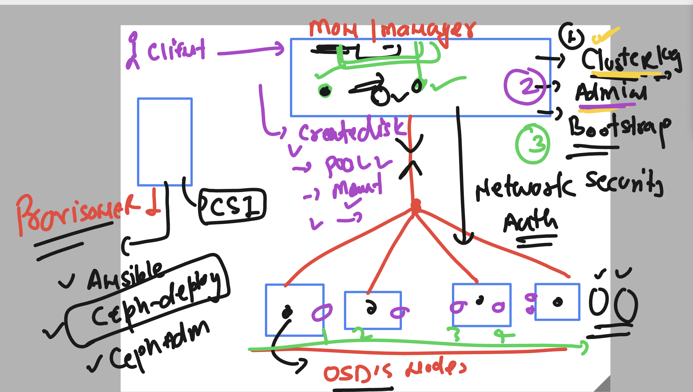

### about Keys of ceph cluster 

### Cluster Key

The cluster key is used to authenticate and authorize communication between the nodes in the Ceph cluster. It ensures that only trusted nodes can join and participate in the cluster.

### Admin Key

The admin key provides administrative access to the Ceph cluster. It allows the user to perform management tasks such as creating and deleting pools, managing OSDs, and configuring the cluster.

### Bootstrap Key

The bootstrap key is used during the initial setup of the Ceph cluster. It allows new nodes to join the cluster and obtain the necessary keys and configuration to become fully functional members of the cluster.

