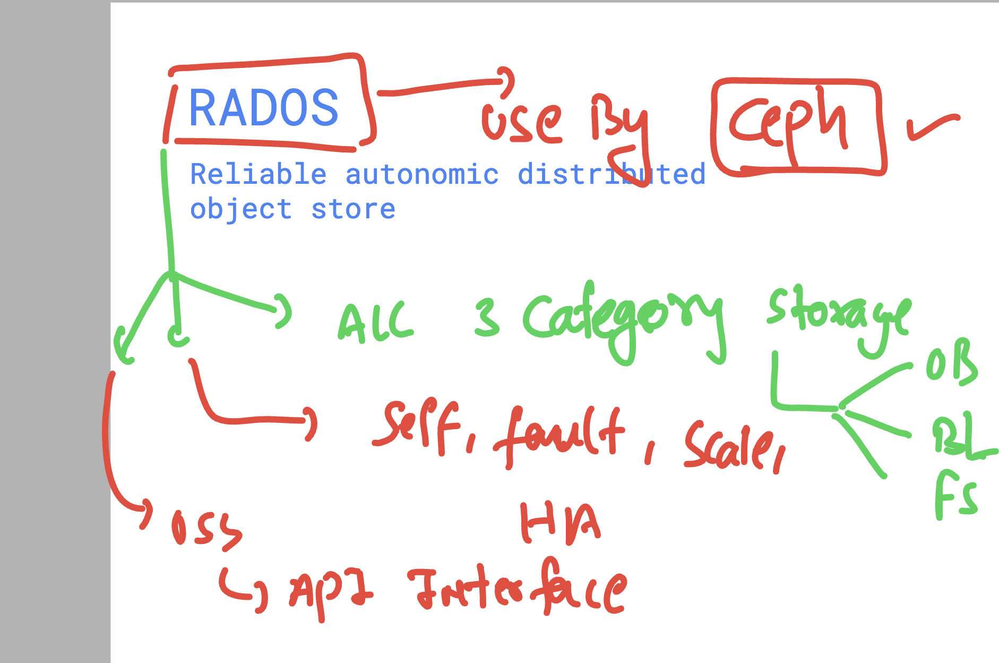

# ceph_Orange10thMarch2025

### Existing storage in  real world 


###  Few problems with existing storage tech 


## Introduction to RADOS 



### Ceph is using LibRADOS to interact with RADOS platform 
## libsRADO can be used by Developers like python , golang 


### Validation of Installation with components


### Info about cluster 

```
ceph -s
  cluster:
    id:     73126190-66a0-425d-bc7b-971b13e67210
    health: HEALTH_WARN
            mon is allowing insecure global_id reclaim
            1 monitors have not enabled msgr2
 
  services:
    mon: 1 daemons, quorum ashu-mon (age 7m)
    mgr: no daemons active
    osd: 0 osds: 0 up, 0 in
 
  data:
    pools:   0 pools, 0 pgs
    objects: 0 objects, 0 B
    usage:   0 B used, 0 B / 0 B avail
    pgs:     
 

```

### In OSD nodes using disk to be used in Cluster 

### creating basic primary partitions in Disk 

```
[root@ashu-node1 ~]# lsblk 
NAME    MAJ:MIN RM  SIZE RO TYPE MOUNTPOINTS
xvda    202:0    0   50G  0 disk 
├─xvda1 202:1    0    1M  0 part 
└─xvda2 202:2    0   50G  0 part /
xvdb    202:16   0  100G  0 disk 
[root@ashu-node1 ~]# fdisk   /dev/xvdb

Welcome to fdisk (util-linux 2.37.4).
Changes will remain in memory only, until you decide to write them.
Be careful before using the write command.


Command (m for help): n
Partition type
   p   primary (0 primary, 0 extended, 4 free)
   e   extended (container for logical partitions)
Select (default p): 

Using default response p.
Partition number (1-4, default 1): 
First sector (2048-209715199, default 2048): 
Last sector, +/-sectors or +/-size{K,M,G,T,P} (2048-209715199, default 209715199): +50G

Created a new partition 1 of type 'Linux' and of size 50 GiB.

Command (m for help): w
The partition table has been altered.
Calling ioctl() to re-read partition table.
Syncing disks.

```

### On each OSD prepare a disk using LVM 

```
ceph-volume  lvm prepare  --data  /dev/xvdb1 
Running command: /usr/bin/ceph-authtool --gen-print-key
Running command: /usr/bin/ceph --cluster ceph --name client.bootstrap-osd --keyring /var/lib/ceph/bootstrap-osd/ceph.keyring -i - osd new 22e145cd-c5d2-44bd-892e-f4bcf148b1aa
Running command: vgcreate --force --yes ceph-0dd2afb0-26a1-49a9-8e24-2d22be59184f /dev/xvdb1
 stdout: Physical volume "/dev/xvdb1" successfully created.
  Creating devices file /etc/lvm/devices/system.devices
 stdout: Volume group "ceph-0dd2afb0-26a1-49a9-8e24-2d22be59184f" successfully created
Running command: lvcreate --yes -l 12799 -n osd-block-


====>
ceph-volume  lvm create    --data  /dev/xvdb1 
```

### listing lvm 

```
ceph-volume  lvm list


====== osd.0 =======

  [block]       /dev/ceph-0dd2afb0-26a1-49a9-8e24-2d22be59184f/osd-block-22e145cd-c5d2-44bd-892e-f4bcf148b1aa

      block device              /dev/ceph-0dd2afb0-26a1-49a9-8e24-2d22be59184f/osd-block-22e145cd-c5d2-44bd-892e-f4bcf148b1aa
      block uuid                e4Gb3F-Uw75-OSqr-ty5N-xSne-h70P-AzJenR
      cephx lockbox secret      
      cluster fsid              73126190-66a0-425d-bc7b-971b13e67210
      cluster name              ceph
      crush device class        
      encrypted                 0
      osd fsid                  22e145cd-c5d2-44bd-892e-f4bcf148b1aa
      osd id                    0
      osdspec affinity          
      type                      block
      vdo                       0
      devices                   /dev/xvdb1

```

### Monitor server in CEPH cluster usage 


### More info about Monitor map and client 


## ON OSD 

### steps
i) we have disk  (use or do partitions)
ii) creating lvm using ceph-volume 
iii)  activating lvm (if required) systemctl status ceph-osd@1

### checking OSD details 

```
[root@ashu-node2 ~]# ceph osd stat
2 osds: 2 up (since 54s), 2 in (since 54s); epoch: e12
[root@ashu-node2 ~]# ceph osd tree
ID  CLASS  WEIGHT   TYPE NAME            STATUS  REWEIGHT  PRI-AFF
-1         0.09760  root default                                  
-3         0.04880      host ashu-node1                           
 1    ssd  0.04880          osd.1            up   1.00000  1.00000
-5         0.04880      host ashu-node2                           
 0    ssd  0.04880          osd.0            up   1.00000  1.00000

 ```

 ### Creating pool and checking replica

 ```
 [root@ashu-mon ~]# ceph osd  lspools 
[root@ashu-mon ~]# 
[root@ashu-mon ~]# 
[root@ashu-mon ~]# ceph osd  pool create ashu_pool1  128 
pool 'ashu_pool1' created
[root@ashu-mon ~]# ceph osd  lspools 
1 ashu_pool1
[root@ashu-mon ~]# ceph osd  pool get  ashu_pool1 size 
size: 3
[root@ashu-mon ~]# 


```
### Initial as this pool to block device pool

```
rbd  pool init ashu_pool1

```

### checking placement group in a pool

```
[root@ashu-mon ~]# ceph osd lspools
1 ashu_pool1
[root@ashu-mon ~]# 
[root@ashu-mon ~]# ceph osd pool  get ashu_pool1  pg_num 
pg_num: 128
[root@ashu-mon ~]# 

```

### Creating block device parts inside Pool 

```
[root@ashu-mon ~]# ceph osd pool  get ashu_pool1  pg_num 
pg_num: 128
[root@ashu-mon ~]# ceph osd lspools 
1 ashu_pool1
[root@ashu-mon ~]# rbd  create  --size 5G  ashu_pool1/ashu_part1 
[root@ashu-mon ~]# rbd  ls  ashu_pool1
ashu_part1
[root@ashu-mon ~]# 
[root@ashu-mon ~]# rbd  create  --size 15G  ashu_pool1/ashu_part2 
[root@ashu-mon ~]# rbd  ls  ashu_pool1
ashu_part1
ashu_part2
[root@ashu-mon ~]# rbd  create  --size 150G  ashu_pool1/ashu_os_disk 
[root@ashu-mon ~]# 
[root@ashu-mon ~]# rbd  ls  ashu_pool1
ashu_os_disk
ashu_part1
ashu_part2
[root@ashu-mon ~]# RDB ceph -- using LVM thin provisioning to over commit the size 

===> info 

[root@ashu-mon ~]# rbd  info   ashu_pool1/ashu_part1
rbd image 'ashu_part1':
	size 5 GiB in 1280 objects
	order 22 (4 MiB objects)
	snapshot_count: 0
	id: 3758bc338315
	block_name_prefix: rbd_data.3758bc338315
	format: 2
	features: layering, exclusive-lock, object-map, fast-diff, deep-flatten
	op_features: 
	flags: 
	create_timestamp: Tue Mar 11 10:07:44 2025
	access_timestamp: Tue Mar 11 10:07:44 2025
	modify_timestamp: Tue Mar 11 10:07:44 2025

```

### Getting ready with CEPH client 

```
dnf -y install centos-release-ceph-reef epel-release 
dnf install ceph-common  -y 

## Download Monitor and client key details 

[root@ip-172-31-0-33 ~]# cd /etc/ceph/
[root@ip-172-31-0-33 ceph]# ls
rbdmap
[root@ip-172-31-0-33 ceph]# scp  172.31.4.54:/etc/ceph/ceph.conf  /etc/ceph/
The authenticity of host '172.31.4.54 (172.31.4.54)' can't be established.
ED25519 key fingerprint is SHA256:JdD6/h2vnpW3Wzhlg6/WMaGRzJsiZOVITSuX0wPZxkA.
This key is not known by any other names
Are you sure you want to continue connecting (yes/no/[fingerprint])? yes
Warning: Permanently added '172.31.4.54' (ED25519) to the list of known hosts.
root@172.31.4.54's password: 
ceph.conf                                                                                                  100%  646   335.6KB/s   00:00    
[root@ip-172-31-0-33 ceph]# scp  172.31.4.54:/etc/ceph/ceph.client.admin.keyring  /etc/ceph/
root@172.31.4.54's password: 
ceph.client.admin.keyring                                                                                  100%  151    58.1KB/s   00:00    
[root@ip-172-31-0-33 ceph]# ls
ceph.client.admin.keyring  ceph.conf  rbdmap
[root@ip-172-31-0-33 ceph]# ls -lh 
total 12K
-rw-------. 1 root root 151 Mar 11 11:26 ceph.client.admin.keyring
-rw-r--r--. 1 root root 646 Mar 11 11:26 ceph.conf
-rw-r--r--. 1 root root  92 Sep 23 17:01 rbdmap
[root@ip-172-31-0-33 ceph]#  

====>
  10   chown ceph:ceph  ceph.* 
   11  ls -l 
   12  ceph -s
   13  ceph osd lspools 
   14  rbd ls ashu_pool1
   15  rbd info  ashu_pool1/ashu_part1
```

### mapping block device to client 

```
[root@ip-172-31-0-33 ceph]# lsblk 
NAME    MAJ:MIN RM SIZE RO TYPE MOUNTPOINTS
xvda    202:0    0  10G  0 disk 
├─xvda1 202:1    0   1M  0 part 
└─xvda2 202:2    0  10G  0 part /
[root@ip-172-31-0-33 ceph]# rbd map ashu_pool1/ashu_part1  
/dev/rbd0
[root@ip-172-31-0-33 ceph]# lsblk 
NAME    MAJ:MIN RM SIZE RO TYPE MOUNTPOINTS
xvda    202:0    0  10G  0 disk 
├─xvda1 202:1    0   1M  0 part 
└─xvda2 202:2    0  10G  0 part /
rbd0    252:0    0   5G  0 disk 

```

### Format and mounting device permanently 

```
 23  mkfs.xfs    /dev/rbd0 
   24  mkdir  /mnt/ashu
   25  mount  /dev/rbd0   /mnt/ashu/
   26  df -hT
   27  vim /etc/fstab 
   28  dnf install vim -y
   29  history 
[root@ip-172-31-0-33 ceph]# df -hT
Filesystem     Type      Size  Used Avail Use% Mounted on
devtmpfs       devtmpfs  4.0M     0  4.0M   0% /dev
tmpfs          tmpfs     885M     0  885M   0% /dev/shm
tmpfs          tmpfs     354M  9.4M  345M   3% /run
/dev/xvda2     xfs        10G  1.5G  8.6G  15% /
tmpfs          tmpfs     177M     0  177M   0% /run/user/1000
/dev/rbd0      xfs       5.0G   68M  4.9G   2% /mnt/ashu
[root@ip-172-31-0-33 ceph]# vim /etc/fstab 
[root@ip-172-31-0-33 ceph]# cat  /etc/fstab 

#
# /etc/fstab
# Created by anaconda on Mon Mar  3 04:11:47 2025
#
# Accessible filesystems, by reference, are maintained under '/dev/disk/'.
# See man pages fstab(5), findfs(8), mount(8) and/or blkid(8) for more info.
#
# After editing this file, run 'systemctl daemon-reload' to update systemd
# units generated from this file.
#
UUID=1ba38c21-a870-4f86-b09d-c70a929511b2 /                       xfs     defaults        0 0

/dev/rbd0      /mnt/ashu        xfs  _netdev 0  0 
[root@ip-172-31-0-33 ceph]# blkid 
/dev/xvda2: UUID="1ba38c21-a870-4f86-b09d-c70a929511b2" TYPE="xfs" PARTUUID="189caf23-e42e-4c9b-aea4-157b24c9af45"
/dev/rbd0: UUID="cf0416fb-87e1-43d9-8a57-ae594a67431c" TYPE="xfs"
/dev/xvda1: PARTUUID="5946971f-6ca7-4c20-a19e-253ef9bf8966"
[root@ip-172-31-0-33 ceph]# vim /etc/fstab 
[root@ip-172-31-0-33 ceph]# cat  /etc/fstab 

#
# /etc/fstab
# Created by anaconda on Mon Mar  3 04:11:47 2025
#
# Accessible filesystems, by reference, are maintained under '/dev/disk/'.
# See man pages fstab(5), findfs(8), mount(8) and/or blkid(8) for more info.
#
# After editing this file, run 'systemctl daemon-reload' to update systemd
# units generated from this file.
#
UUID=1ba38c21-a870-4f86-b09d-c70a929511b2 /                       xfs     defaults        0 0

UUID="cf0416fb-87e1-43d9-8a57-ae594a67431c"      /mnt/ashu        xfs  _netdev 0  0 

```
### TO load rbdmap device there are 2 approaches 

# method 1 -- linux kernel way 

```
[root@ip-172-31-0-33 ~]# chmod +x /etc/rc.local 
[root@ip-172-31-0-33 ~]# cat  /etc/rc.local 
#!/bin/bash
# THIS FILE IS ADDED FOR COMPATIBILITY PURPOSES
#
# It is highly advisable to create own systemd services or udev rules
# to run scripts during boot instead of using this file.
#
# In contrast to previous versions due to parallel execution during boot
# this script will NOT be run after all other services.
#
# Please note that you must run 'chmod +x /etc/rc.d/rc.local' to ensure
# that this script will be executed during boot.

touch /var/lock/subsys/local

rbd map ashu_pool1/ashu_part1

```

### method 2  -- ceph way 

```
[root@ip-172-31-0-33 ~]# # method 2 
[root@ip-172-31-0-33 ~]# echo "rbd"  | tee -a /etc/modules 
rbd
[root@ip-172-31-0-33 ~]# vim /etc/ceph/rbdmap 
[root@ip-172-31-0-33 ~]# ls  /etc/ceph/ceph.client.admin.keyring 
/etc/ceph/ceph.client.admin.keyring
[root@ip-172-31-0-33 ~]# vim /etc/ceph/rbdmap 
[root@ip-172-31-0-33 ~]# 
[root@ip-172-31-0-33 ~]# cat /etc/ceph/rbdmap 
# RbdDevice		Parameters
#poolname/imagename	id=client,keyring=/etc/ceph/ceph.client.keyring
ashu_pool1/ashu_part1	id=admin,keyring=/etc/ceph/ceph.client.admin.keyring 
[root@ip-172-31-0-33 ~]# 
[root@ip-172-31-0-33 ~]# 
[root@ip-172-31-0-33 ~]# systemctl status rbdmap 
○ rbdmap.service - Map RBD devices
     Loaded: loaded (/usr/lib/systemd/system/rbdmap.service; disabled; preset: disabled)
     Active: inactive (dead)
[root@ip-172-31-0-33 ~]# systemctl start rbdmap 
[root@ip-172-31-0-33 ~]# systemctl status rbdmap 
● rbdmap.service - Map RBD devices
     Loaded: loaded (/usr/lib/systemd/system/rbdmap.service; disabled; preset: disabled)
     Active: active (exited) since Tue 2025-03-11 11:58:01 UTC; 1s ago
    Process: 4274 ExecStart=/usr/bin/rbdmap map (code=exited, status=0/SUCCESS)
   Main PID: 4274 (code=exited, status=0/SUCCESS)
        CPU: 10ms

Mar 11 11:58:01 ip-172-31-0-33.us-east-2.compute.internal systemd[1]: Starting Map RBD devices...
Mar 11 11:58:01 ip-172-31-0-33.us-east-2.compute.internal rbdmap[4276]: Mapping 'ashu_pool1/ashu_part1'
Mar 11 11:58:01 ip-172-31-0-33.us-east-2.compute.internal rbdmap[4278]: Mapped 'ashu_pool1/ashu_part1' to '/dev/rbd0'
Mar 11 11:58:01 ip-172-31-0-33.us-east-2.compute.internal systemd[1]: Finished Map RBD devices.
[root@ip-172-31-0-33 ~]# systemctl enable  rbdmap 
Created symlink /etc/systemd/system/multi-user.target.wants/rbdmap.service → /usr/lib/systemd/system/rbdmap.service.
[root@ip-172-31-0-33 ~]# 

```


### alternative to lsblk in ceph 

```
[root@ip-172-31-0-33 ~]# rbd showmapped
id  pool        namespace  image       snap  device   
0   ashu_pool1             ashu_part1  -     /dev/rbd0

```
