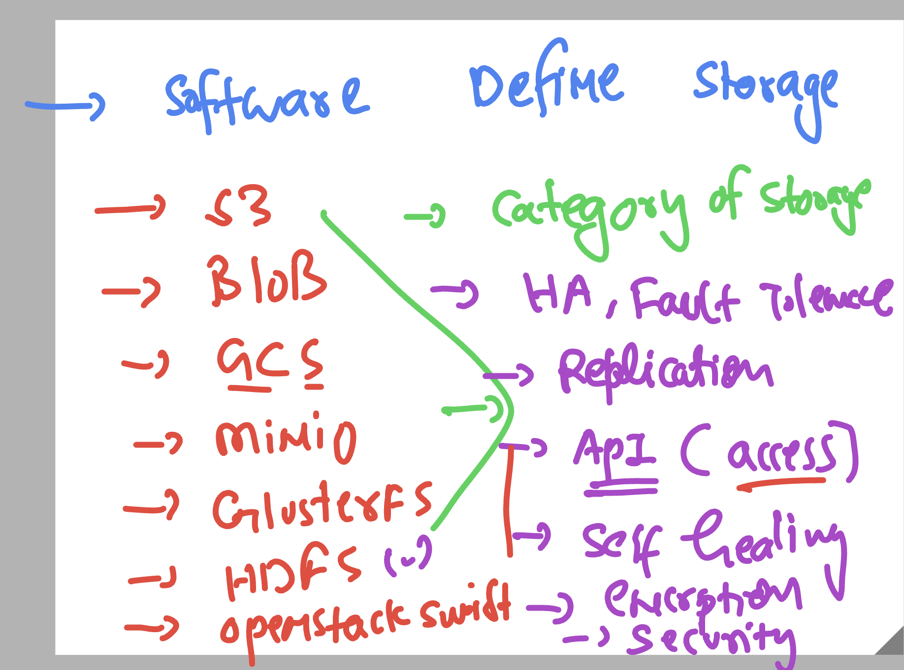
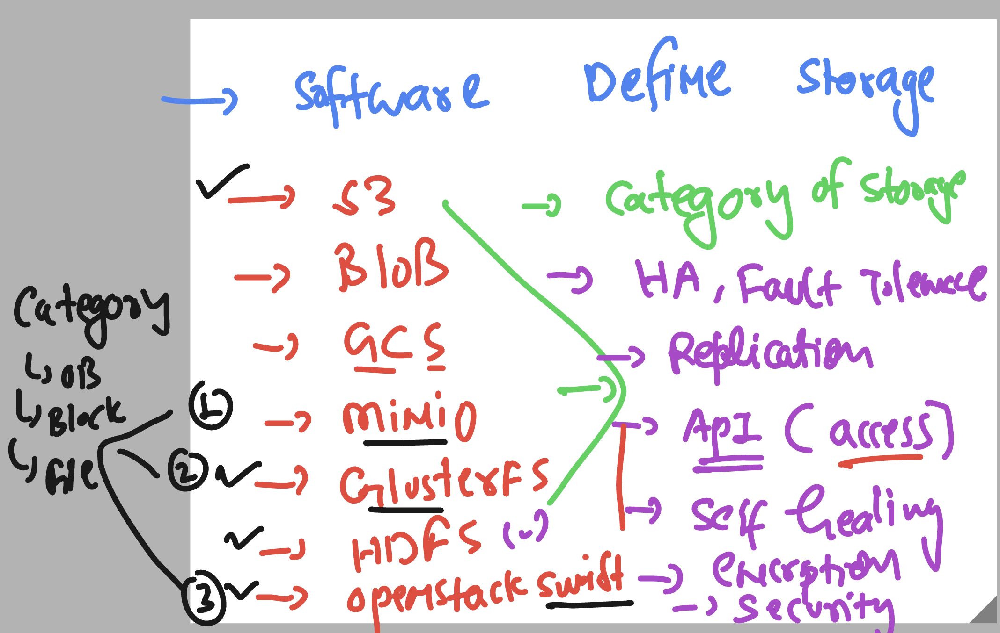

# ceph_Orange10thMarch2025

### Existing storage in  real world 



###  Few problems with existing storage tech 



## Introduction to RADOS 


### Ceph is using LibRADOS to interact with RADOS platform 
## libsRADO can be used by Developers like python , golang 


### Validation of Installation with components


### Info about cluster 

```
ceph -s
  cluster:
    id:     73126190-66a0-425d-bc7b-971b13e67210
    health: HEALTH_WARN
            mon is allowing insecure global_id reclaim
            1 monitors have not enabled msgr2
 
  services:
    mon: 1 daemons, quorum ashu-mon (age 7m)
    mgr: no daemons active
    osd: 0 osds: 0 up, 0 in
 
  data:
    pools:   0 pools, 0 pgs
    objects: 0 objects, 0 B
    usage:   0 B used, 0 B / 0 B avail
    pgs:     
 

```

### In OSD nodes using disk to be used in Cluster 

### creating basic primary partitions in Disk 

```
[root@ashu-node1 ~]# lsblk 
NAME    MAJ:MIN RM  SIZE RO TYPE MOUNTPOINTS
xvda    202:0    0   50G  0 disk 
├─xvda1 202:1    0    1M  0 part 
└─xvda2 202:2    0   50G  0 part /
xvdb    202:16   0  100G  0 disk 
[root@ashu-node1 ~]# fdisk   /dev/xvdb

Welcome to fdisk (util-linux 2.37.4).
Changes will remain in memory only, until you decide to write them.
Be careful before using the write command.


Command (m for help): n
Partition type
   p   primary (0 primary, 0 extended, 4 free)
   e   extended (container for logical partitions)
Select (default p): 

Using default response p.
Partition number (1-4, default 1): 
First sector (2048-209715199, default 2048): 
Last sector, +/-sectors or +/-size{K,M,G,T,P} (2048-209715199, default 209715199): +50G

Created a new partition 1 of type 'Linux' and of size 50 GiB.

Command (m for help): w
The partition table has been altered.
Calling ioctl() to re-read partition table.
Syncing disks.

```
